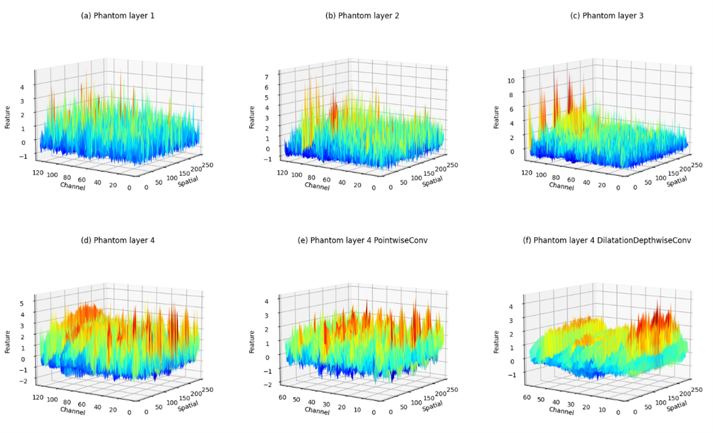

# Bearing_Fault_Diagnosis

## Project Introduction

### This project builds the full-process code of vibration signal bearing fault diagnosis based on deep learning (pytorch framework) from data processing to training, evaluation, and reasoning.

*PhantomCNN* is the algorithm I proposed in my graduation thesis (2024). I personally think that PhantomCNN has a very good network structure.
It uses wide kernel convolution layers to compress data and expand channels of the original vibration signal; then it uses multi-layer stacking of lightweight multi-angle feature fusion modules PhantomLayer to learn multi-angle features; finally, the learned features are globally averaged and pooled, and classified using fully connected layers and Softmax layers. For each layer, the network uses the PReLU activation function to improve the nonlinear fitting ability of the model. Due to the small number of parameters, PhantomCNN uses PReLU to avoid some neurons outputting zero and failing to learn. The BN layer is used to batch normalize the input of each layer to prevent the gradient from disappearing. After the first layer of wide kernel convolution, the data dimension will become C×W (assuming BatchSize=1). Thanks to the powerful receptive field and excellent computational efficiency of the large kernel channel-by-channel dilated convolution, the data does not need to be downsampled in the middle layer of the network, which also reduces the loss of detail features caused by pooling downsampling. The overall structure of PhantomCNN is shown below.

PhantomLayer consists of point-by-point convolution, large kernel channel-by-channel dilated convolution, and ECA attention mechanism. Pointwise convolution (PointwiseConv) is a convolution with a convolution kernel size of 1. Its calculation is no different from ordinary convolution, but the number of parameters is small. Applying pointwise convolution to the middle layer of the network can realize feature extraction of signals at different spatial positions across channels, while capturing the instantaneous features of signals at close range. Point-by-point convolution has the same cross-channel information interaction integration and dimensionality reduction and dimensionality increase capabilities as ordinary convolution, and at the same time, it retains spatial information compared to the fully connected layer. Large-kernel channel-by-channel dilated convolution (DilatationDepthwiseConv) combines channel-by-channel convolution and dilated convolution. Channel-by-channel convolution can learn the difference characteristics between different channels, and the convolution kernel size can be set large enough by taking advantage of the extremely small number of channel-by-channel convolution parameters; while dilated convolution can further improve the receptive field without increasing the number of parameters, so that the model can learn long-distance related features. At the same time, the hollow characteristics of dilated convolution enhance the model's ability to resist noise interference. The following figure shows the schematic diagram of the effect of dilated convolution on one-dimensional signals.

The receptive field of the dilated convolution of the large-core main channel is affected by the size of the convolution kernel and the size of the feature map. In the past, researchers usually used small-core convolution for feature extraction, but the receptive field of small-core convolution is too small to use the long-distance context information of the signal. To make up for this shortcoming, the pooling layer is usually placed after the convolution layer. The pooling layer can compress the size of the feature map, making the receptive field of the next convolution layer larger. Through this layer-by-layer downsampling method, the receptive field is indeed increased, but whether it is maximum pooling or average pooling, the feature map is compressed and information is lost. The large-core channel-by-channel dilated convolution designed by this method has a strong receptive field in a single layer. It can not only learn long-distance related features, but also make the convolution layer no longer bound to the pooling layer. The signal feature map will not be downsampled in the middle layer, retaining the phase information of the signal and avoiding the loss of features in deep downsampling. The ECA attention mechanism is an efficient channel attention mechanism. It further selects important feature channels by giving weights to channels. The number of parameters of the ECA attention mechanism is only a constant order of magnitude, but ECA is not necessary.
The specific structure diagram of PhantomLayer is shown in the figure below.

C×W data will be calculated from two branches. In the main branch, C×W data will first undergo point-by-point convolution to learn the instantaneous features of close distances and features of different spatial positions. At the same time, the dimension becomes C/2×W. After that, the data will be retained first, and then sent to the large core channel-by-channel expansion convolution to learn the different features of different channels and the long-distance induced correlation features. The retained data that has only undergone point-by-point convolution and the data that has undergone large core channel-by-channel expansion convolution are spliced ​​in the channel dimension to achieve the fusion of four angle features. The data dimension returns to C×W. In the secondary branch, C×W data will first undergo global average pooling, and then use ECA attention to calculate the channel weights, and then assign weights to each channel to obtain weighted data, and the dimension is still C×W. After the calculation of the main branch and the secondary branch is completed, the C×W data of the two branches are added using the residual method to reduce information loss, and then sent to the next layer PhantomLayer. Experiments have shown that this structure has an excellent recognition rate in bearing fault diagnosis, and the number of parameters and FLOPs are smaller than other networks of the same type.

### Some experimental results and visualization effects of PhantomCNN are shown below.

#### 1. Model parameter comparison chart:

From this figure, we can see the lightweight of PhantomCNN.

#### 2. CWRU dataset D recognition accuracy line chart of different methods with different signal-to-noise ratios:

From this figure, we can see the excellent noise resistance of PhantomCNN.

#### 3. t-SNE dimensionality reduction diagram of PhantomCNN feature maps at different layers when the signal-to-noise ratio is 8dB:

#### 4. Accuracy line chart of different models fine-tuned by 1%-5% natural damage dataset samples:

From this figure, it can be seen that PhantomCNN has excellent generalization ability and can be migrated to small sample datasets.

#### 5. 3D visualization of feature maps after data passes through certain layers of PhantomCNN (as shown in a, b, c, d, e, f in the figure):

#### 6. Heartmap of feature maps after data passes through point-by-point convolution and large-core channel-by-channel dilation convolution:

This figure (the number of channels and data length are scaled by a factor of 2, and the number of channels shown is 32 and the data length is 128) shows the feature map of the data after point-by-point convolution and large-core channel-by-channel dilated convolution in PhantomLayer4. It can be clearly seen that in the same channel, the distribution range of each high-attention feature of point-by-point convolution is small, and the learned features are local features at close range. The distribution range of high-attention features of large-core channel-by-channel dilated convolution is wide, and it can almost pay attention to the information of the entire data length, and learn the long-distance and large-range related features. From this figure, it can also be seen that the model shows different attention to different channels.

## Project Usage

The operating environment of this project is very simple. My operating environment is pytorch 1.12 (gpu), and it can be run on almost all pytorch versions greater than or equal to 1.12 (if an error is reported, you can contact me through issues). Of course, it can also run on pytorch-cpu, but it is slower.

## Important ⭐⭐⭐⭐⭐

I hope that researchers will fork this project and make further improvements to the network structure and project code (the project hopes to increase flexibility so that developers in this field can train and tune new models with low code costs) to promote the development of deep learning bearing fault diagnosis methods.
At the same time, if you think this project is good, I hope you will give it a star. Thank you!

If you have any questions or suggestions, please go to issues to ask.

## License ⭐⭐⭐⭐⭐

The license agreement of this project is [GPL-3.0 license](https://github.com/Phantom-X/Bearing_Fault_Diagnosis/blob/master/LICENSE). If you use this method (*PhantomCNN*) or other commercial purposes, please attach the project link and license agreement in the description.

## Reference ⭐⭐⭐⭐⭐

https://github.com/liguge/MIXCNN_pytorch

https://github.com/liguge/1D-Grad-CAM-for-interpretable-intelligent-fault-diagnosis
